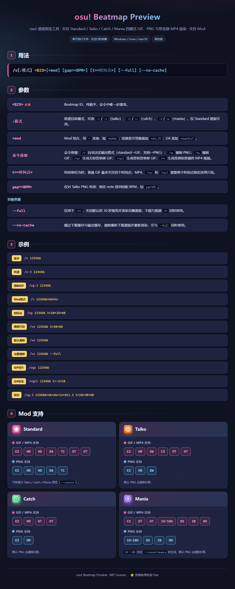

# astrbot_plugin_osu_beatmap_preview

把 Rust 版 `osu-beatmap-preview` core 封装成 AstrBot 插件，通过调用二进制文件渲染谱面预览图和带原始音频的 MP4 视频。

## 功能如图



视频使用 `/vv <BID>` 默认渲染 `PreviewTime` 附近约 30 秒。加上 `--full` 可渲染完整谱面；填写 `t=` 时用两个时间点指定片段的起点和终点，单位为秒，例如：

```text
/vv 123456 t=30+60
/vv 123456 --full
```

`/vgc <BID>` 和 `/vgcl <BID>` 分别生成无时间标签和带时间标签的单屏连续 GIF，也可以用 `t=起点+终点` 指定范围。

## 核心配置

插件使用上游 v1.1.1 的 `--config` 接口，并在每次请求前合并配置页中的 JSON：

- `default_json`：上游配置覆盖，字段使用 `timeout`、`render.<mode>.<format>.structure/style` 等当前配置结构，默认包含核心超时、各模式 30 FPS 和 Taiko PNG 默认 gap。
- `/vgc` 和 `/vgcl` 的单屏 GIF 布局由插件固定提供；两者的 Mania GIF 都不显示 SV 标签。

配置会递归合并后作为单个内联 JSON 传给核心，因此 `gap=` 和自定义单屏时长可与上述布局同时生效。

JSON 使用大文本编辑框展示。保存后会从下一次渲染请求开始生效，无需修改插件目录或重启。

## 安装

### 方式一：从插件市场安装（不可用：一直没人审核）

在 AstrBot WebUI 中打开插件市场，搜索：`osu!谱面预览` 找到插件后点击安装即可。

### 方式二：手动安装

1. 克隆项目

```bash
git clone https://github.com/2710165659/astrbot_plugin_osu_beatmap_preview.git
```

2. 安装插件

任选一种方式：

* 将项目文件夹压缩为 ZIP 后，在 AstrBot WebUI 中上传安装
* 或将整个 `astrbot_plugin_osu_beatmap_preview` 文件夹复制到 AstrBot 的插件目录中

插件目录一般为：

```text
AstrBot/data/plugins/
```

3. 重启 AstrBot，或在 WebUI 中重载插件

### 方式三：通过github链接安装

在 AstrBot WebUI 中，进入插件管理页面，点击「通过 GitHub 链接安装」，输入以下地址：

```
https://github.com/2710165659/astrbot_plugin_osu_beatmap_preview
```

等待安装完成后重启 AstrBot 即可。

## 更新 core

运行以下脚本，自动从 [osu-beatmap-preview](https://github.com/2710165659/osu-beatmap-preview) 最新 release 下载四个平台的二进制文件到 `bin/` 目录：

```bat
.\update_core.bat
```

二进制文件按平台自动选择：
- Windows: `bin/osu-beatmap-preview-windows-amd64.exe`
- Linux: `bin/osu-beatmap-preview-linux-amd64`
- macOS Intel: `bin/osu-beatmap-preview-macos-amd64`
- macOS Apple Silicon: `bin/osu-beatmap-preview-macos-arm64`
